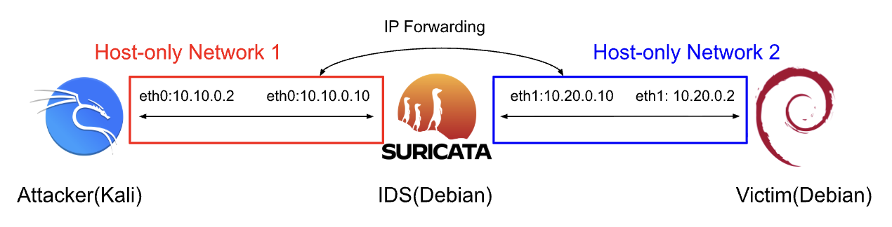
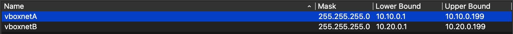

# I. Introduction
To gain hands-on experience with networks, cyberattacks, and intrusion detection systems(IDS), I created a virtual environment to simulate attacks on a vulnerable web application. To detect the attacks, I wrote custom rules for specific attacks in Suricata and used Evebox for visualizing alerts. This project has improved my skills in network architecture, network security, intrusion detection, Linux, SQL, and PHP, as well as using virtual machines.

The tools I used are:
- VirtualBox: a hypervisor to run the virtual machines(VMs) and set up an inline routing system
- Debian & Kali Linux: the latest version of Debian operating systems for the victim and the IDS, and Kali for the attacker
- Apache, MySQL(MariaDB), & PHP: to create and run the vulnerable web app, completing the LAMP stack
- Suricata & Evebox: IDS and a web visualization of alerts
- nmap, sqlmap, hydra, & hping3: Attack tools built-in to Kali used in this project

**Architecture:**

Host-only networks were the best way to isolate the lab environment from the Internet, so I used two of them(one for the attacker, one for the victim) to create an inline routing network topology. In the first subnet, the attacker sends packets to one of the IDS's interfaces, also on that same network. The IDS then forwards the packets through its second interface to the victim, on the second subnet. I used inline routing to better simulate how an actual IDS would work, placed at a gateway.

Subnet 1: 10.10.0.0/24, Traffic Flow: Attacker <-> IDS, Subnet 2: 10.20.0.0/24, Traffic Flow: Victim <-> IDS

The attacker at 10.10.0.2 uses the gateway 10.10.0.10, the IDS VM, to send packets to the victim at 10.20.0.2. Similarly, the victim at 10.20.0.2 uses the gateway 10.20.0.10, again the IDS VM, to send packets back to the attacker at 10.10.0.2. This way, Suricata captures all the packets being sent back and forth, and the IDS VM doesn't have to be set to promiscuous mode.
# II. Lab Setup
| VM | OS | Role | Network Mode | IP Address | RAM | CPU |
|---|---|---|---|---|---|---|
| Attacker | Kali | Offensive | Host-Only | 10.10.0.2 | 4GB | 2 cores |
| Victim | Debian 13 | Vulnerable Web App | Host-Only | 10.20.0.2 | 2GB | 2 cores |
| IDS | Debian 13 | Inline Routing & IDS | Host-Only & Host-Only | 10.10.0.10 & 10.20.0.10 | 2GB | 2 cores |

**Inline Routing Setup:** 

First, I started with setting up the inline routing network, as inline routing is the foundation of this project. The first step is to navigate to the network manager in VirtualBox and add two host-only networks. Inline routing can also be done on a single network, but I decided to make two separate networks so the distinction between the attacker and the victim would be clear. 

VirtualBox Network Manager Host-only Networks

Next, go to each VM's network settings and add the appropriate host-only adapters: vboxnetA for the attacker, vboxnetB for the victim, and two adapters for vboxnetA and vboxnetB on the IDS VM. To verify, run each VM and check the networks with "ip a" on the command line. Each one should have an IP in their specific subnets, and for the IDS VM it should have two networks(eth0 and eth1 or enp0s8 and enp0s9) with IPs in both subnets. I would recommend adding a static IP for the IDS VM, as well as the attacker and victim. You can do this by modifying /etc/network/interfaces, which you will need to add these changes to enable IP forwarding:

  

Attacker /etc/network/interfaces

  

Victim /etc/network/interfaces

  

IDS /etc/network/interfaces

Finally, edit /etc/nftables.conf and /etc/sysctl.conf as specified [here](docs/setup). From the attacker VM, ping the IP address of the victim VM and vice versa to make sure the IP forwarding works. From the IDS VM, use tcpdump on one of the networks to view the ICMP traffic going back and forth between the attacker and the victim. 

  

Attacker pinging victim IP

  

Victim pinging attacker IP

  

tcpdump from both enp0s8 and enp0s9 on IDS VM

  
**Vulnerable Web App Setup:**

First, install Apache, MySQL, PHP, and all the associated libraries. Next, create the intentionally vulnerable database, using plaintext to store usernames and passwords. Finally, use insecure practices in the PHP file, like not sanitizing inputs and directly using parameters in database queries.

The installation of Apache, MySQL, and PHP, and creating the intentionally vulnerable database in MySQL is documented [here](docs/setup). The insecure PHP file can be found [here](docs/login.php). The database and website should look like this:

  

Vulnsite database, stored in plaintext

  

Vulnerable login page

Test the login page by inputting the valid login credentials and invalid login credentials, and try to use SQL injection like "' OR '1'='1'" and "admin' OR '1'='1' --". Make sure the attacker VM can access the website either through a browser or through using curl "login page url".

**Suricata and EveBox Setup:**

The final step for setting up the lab is installing Suricata and EveBox. After installation, configure /etc/suricata/suricata.yaml and /etc/evebox/evebox.yaml as shown [here](docs/setup). Then, create a custom.rules file in /etc/suricata/rules with the rules given [here](docs/rules), as well as any other attacks that should be detected. Ensure that Suricata writes alerts to eve.json in suricata.yaml and that EveBox is pointing towards eve.json in evebox.yaml. To test the functionality of Suricata, run a basic nmap scan like:

    nmap -F <victim IP>

Check /var/log/suricata/fast.log for quick alerts, and /var/log/suricata/eve.json to see if Suricata is logging alerts into eve.json. 

To run Suricata in the foreground, use the CLI command:
    
    sudo suricata -c /etc/suricata/suricata.yaml --af-packet

In this project, I ran Suricata in the foreground, so I could control when it was active, but realistically it would always be active in the background. To run EveBox for analysis of the alerts currently in eve.json, use the CLI command:
    
    evebox oneshot /var/log/suricata/eve.json
  
Again, EveBox would realistically be constantly ingesting alerts from eve.json to be viewed at any time, but I found it easier to use oneshot for this project.

  

Running Suricata in the foreground

  

Running a quick test nmap scan from the attacker

  

Logs in fast.log and eve.json

  

Viewing the test nmap scan in EveBox

With this, setup is complete. Inline routing has been configured, the intentionally vulnerable web application is running, and EveBox is ingesting alerts generated by Suricata to be viewed in a web browser.

# III. Attacks

For this project, I ran four attacks: nmap scan for reconnaissance, sqlmap to exploit injection vulnerabilities, hydra to brute-force simple passwords, and a simple DoS attack with hping3. All attack commands and explanations can be found [here](docs/attacks). Associated Suricata rules and explanations can be found [here](docs/rules).

**Attack 1 - nmap Scan:**

The first attack I used was a simple nmap scan of all of the ports on the victim's IP address. The command for the attack is:

    nmap -sS -p- -T4 <victim_ip>

The only open ports found were port 22 (SSH) and port 80 (HTTP). The HTTP port is open because of the web application running on the victim's system, a potential entry point for attackers.

  

Running nmap scan from attacker VM

**Attack 2 - sqlmap:**

The next attack used was sqlmap, an open-source automatic SQL injection tool. Given the attack URL and the contents of the POST form, sqlmap can automatically try various SQL injection methods, and if successful, enumerate databases and tables. The command for the attack is:
    
    sqlmap -u "http://<victim_ip>/login.php" --data="username=admin&password=test" --dbs

Since the PHP file is vulnerable to injection, sqlmap was successful and enumerated the database "vulnsite". This demonstrates the importance of input sanitization in application security, as database content can easily be breached without it.

  

Running sqlmap attack from attacker VM

**Attack 3 - hydra (brute-force):**

The next attack used was hydra, an open-source login cracker with numerous attack protocols. In this case, I used a brute-force login attempt with the password list rockyou.txt, a well-known list of over 14 million unique passwords that comes with Kali. The command for the attack is:  

    hydra -l admin -P /usr/share/wordlists/rockyou.txt <victim_ip> http-post-form "/login.php:username=^USER^&password=^PASS^:Invalid username or password"
    
Given the password list, the error message, and a fixed username, hydra goes through the list of passwords, sending requests to the web app for each password until either a login is successful or it runs out of passwords to test. In this case, hydra was able to quickly crack the weak password "password123", highlighting the importance of a strong password.

  

Running hydra attack from attacker VM

**Attack 4 - DoS with hping3 --flood:**

The last attack used was hping3 --flood, a Denial of Service(DoS) attack. By using the --flood option with hping3, an attacker can send hundreds of thousands of SYN packets to the victim in seconds. By sending only SYN flags and not completing the TCP handshake, the attacker leaves the victim's system waiting for thousands of unfinished handshakes, tying up the system's resources. The command for the attack is: 

    hping3 -S -p 80 --flood <victim_ip>

Note that you may have to use "sudo" to use hping3 on Kali. In the screenshot below, I only ran the command for a second; but over 87,000 packets were sent. This demonstrates the importance of having DoS/DDoS detection and prevention capabilities, as with more advanced DoS/DDoS software, attackers can send millions of packets to their victims.

  

Running DoS attack with hping3 --flood from attacker VM

# IV. Detection

**Detection:**

After executing those attacks, with Suricata running on the IDS VM, the alerts can be viewed on EveBox. As shown in the screenshot below, all four attacks were successfully detected. Attacks are color-coded by type/severity.

  

Alerts generated by Suricata, visualized through EveBox

From the homepage, an overview of the alerts are shown: the timestamp, source and destination IP addresses, and the unique signature assigned to each rule in the .rules file. Clicking on one of the alerts shows a more detailed view. In the screenshot below, I clicked on the brute force attack alert.

  

Detailed view of brute-force alert

In this view, protocol, source and destination ports, network interface, attack category, and more are shown. Through EveBox's web interface, cybersecurity analysts can analyze where the attack came from, how many bytes were sent by the attacker, and even HTTP methods and User-Agent headers. Having a neat way to view alerts is important, as it avoids wasting time trying to understand raw alerts straight from Suricata. 

# IV. Revision & Analysis

The original Suricata rules I used were significantly lacking, generating alerts during the wrong attack or not triggering at all. I had to make modifications to the rules in order to pick up the appropriate activity and generate an alert. All the updated rules and explanations can be found [here](docs/rules). 

**nmap Rule Revision:**

First, I had to modify my nmap port scan detection rule. Originally, it looked like this: 

    alert tcp any any -> $HOME_NET any ( \
        msg:"Nmap SYN Scan Detected"; \
        flags:S; \
        threshold:type both, track by_src, count 20, seconds 3; \
        classtype:attempted-recon; \
        sid:100001; rev:1; \
    )

With this configuration, it essentially is looking for SYN flags from established connections coming to any port, as long as there are more than 20 packets sent within 3 seconds. This would pick up sqlmap and hydra attempts, because sqlmap and hydra both send many SYN packets to the web application to try new injections or passwords. Fortunately it doesn't pick up DoS attempts, because it only looks at established TCP connections. To fix this, I made one simple change: I made the rule only look for traffic going to ports that were not the HTTP port(port 80). A port scan will send many packets to many different ports, so this eliminates false positives caused by connections to the web application while also maintaining the rule functionality. The new rule is: 

    alert tcp $EXTERNAL_NET any -> $HOME_NET !80 ( \
        msg:"Nmap SYN Scan Detected"; \
        flags:S; \
        flow:to_server;
        threshold:type both, track by_src, count 5, seconds 60; \
        classtype:attempted-recon; \
        sid:100001; rev:2; \
    )

**sqlmap Rule Revision:**

Next, my SQL injection rule had to be modified because it wasn't picking up any sqlmap activity. My first iteration was:

    alert http any any -> $HOME_NET any ( \
        msg:"SQL Injection Attack"; \
        flow:to_server,established; \
        content:"' OR 1=1"; nocase; \
        classtype:web-application-attack; \
        sid:100002; rev:1; \
    )

This rule is looking for content flowing to the web application with the specific injection attack "' OR 1=1". This seems like a good strategy, but sqlmap sends a variety of injection payloads, not just this specific example. Even so, it should be triggered at least once, but no alert was generated after multiple attempts. This is because sqlmap sends URL-encoded payloads, replacing non-ASCII characters with "%" and two hexadecimal numbers and replacing spaces with "+" symbols. So while the packets are routed through the IDS VM, they would be URL-encoded and wouldn't generate this specific injection alert. To fix this, I instead focused directly on sqlmap injection attempts, by looking for "sqlmap" within the User-Agent header of the HTTP request. With this modification, the rule picked up every sqlmap attack because every sqlmap HTTP request contains "sqlmap" in the User-Agent header. However, this will only generate alerts when sqlmap is used, not standalone injection attempts. The modified rule is:

    alert http $EXTERNAL_NET any -> $HOME_NET any ( \
        msg:"SQLmap Injection Attack"; \
        flow:to_server,established; \
        content:"'sqlmap"; http_user_agent; \
        classtype:web-application-attack; \
        sid:100002; rev:2; \
    )

**Brute-Force Rule Revisions:**

The original rule for detecting brute-force login attempts, such as a hydra attack, would consistently trigger, but still required a few tweaks. The original version was: 

    alert http any any -> $HOME_NET any (
        msg:"ET WEB Brute Force Login Attempt"; 
        flow:to_server,established; 
        content:"POST"; http_method; 
        threshold:type both, track by_src, count 10, seconds 30; 
        classtype:attempted-recon; 
        sid:100003; rev:1;
    )

This version generated alerts whenever more than 10 POST requests were sent from one source to the web application in 30 seconds or less. This worked for detecting hydra, as hydra would send hundreds of POST requests per second. However, to improve the rule's capability of detecting brute-force attacks, I modified it to instead look for packets moving from the protected subnet to the external net. Specifically, packets being sent out by the server containing the invalid login message. Although the two rules function similarly when a brute-force attack is executed, looking specifically for an IP outside the net receiving multiple invalid login messages is the best practice for brute-force detection. The new rule is:

    alert http $HOME_NET any -> $EXTERNAL_NET any ( \
        msg:"Brute Force Login Attempt"; \
        flow:to_client,established; \
        content:"Invalid username or password"; nocase; \
        threshold:type both, track by_dst, count 10, seconds 30; \
        classtype:attempted-admin; \
        sid:100003; rev:2; \
    )

**DoS Rule Revisions:**

The first DoS rule I created only generated alerts when a hydra attack was executed and not when the DoS command was executed. Originally it looked like this:

    alert tcp any any -> $HOME_NET 80 (
        msg:"DoS TCP SYN Flood"; 
        flags:S; 
        threshold:type both, track by_src, count 100, seconds 1; 
        classtype:attempted-dos; 
        sid:100004; rev:1;
    )

The problem was that the rule was too sensitive, meaning the many SYN flags sent from hydra were being triggering the rule. It didn't pick up the execution of hping3, however, because this rule is looking specifically for SYN flags from established connections. Hping3 does not complete the TCP handshake, so the SYN flags sent during execution aren't included in this rule. As a way to avoid generating alerts during the hydra attack, I modified the rule to look specifically for GET requests, instead of the POST requests used by hydra. My second iteration looked like this:

    alert http $EXTERNAL_NET any -> $HOME_NET any (
        msg:"Potential DoS Attack - Excessive GET Flood";
        flow:to_server,established;
        content:"GET"; http_method;
        threshold:type both, track by_src, count 200, seconds 5;
        sid:100004; rev:2;
    )

However, this did not generate alerts either, because hping3 did not send GET requests to the HTTP port. Instead, hping3 sends SYN packets, initiating a TCP handshake but never completing it to engage system resources. In order to generate alerts specifically for a hping3 SYN flood, I changed my rule back to looking for mass SYN packets sent to the web application, except raising the threshold significantly and looking specifically for SYN packets that aren't part of an established connection. Instead of using "threshold", I used "detection_filter", which generates alerts multiple times until the rate of SYN packets to the web application fell below the detection rate. This way, instead of generating one alert for an entire DoS attack, alerts will be generated throughout the duration of the attack. The finalized rule is:

    alert tcp $EXTERNAL_NET any -> $HOME_NET 80 ( \
        msg:"Potential TCP SYN Flood"; \
        flags:S; \
        flow:stateless; \
        detection_filter:type both, track by_src, count 500, seconds 1; \
        classtype:attempted-dos; \
        sid:100004; rev:3; \
    )

**Analysis of Revised Rules:**

Overall, the revised rules tested well against their respective attacks, able to detect and generate alerts for each instance of the attack. For the purpose of detecting the specific attack software used, the rules work great, but it is important to address the significant gaps of each rule. To detect more advanced versions of port scans, SQL injections, brute-force attacks, and DoS/DDoS attacks, many more revisions and rules will have to be implemented.

The nmap scan detection rule worked well in testing, even detecting nmap's slowest scan rate(-T1). It consistently generated alerts for the execution of nmap's SYN scan, but adding a simple scan delay allowed nmap to evade detection. There are many other nmap scan options like fragmentation of packets or decoys to avoid generating alerts or mislead IDSs, not to mention the different scan types like ping scans and UDP scans. Also, the low detection threshold(5 SYN packets in 60 seconds) is good for identifying patient attackers, but if other TCP ports were open, the rule would frequently generate false positives. 
