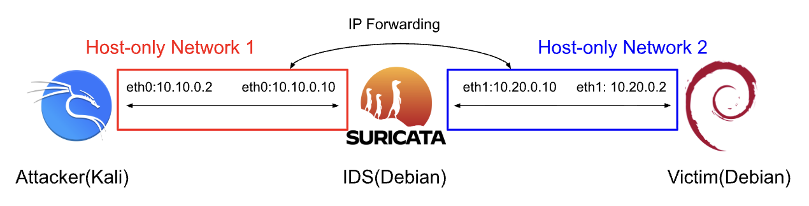

# I. Introduction
To gain hands-on experience with networks, cyberattacks, and intrusion detection systems(IDS), I created a virtual environment to simulate attacks on a vulnerable web application. To detect the attacks, I wrote custom rules for specific attacks in Suricata and used Evebox for visualizing alerts. This project has improved my skills in Linux, SQL, networking, 

The tools I used are:
- VirtualBox: a hypervisor to run the virtual machines(VMs) and set up an inline routing system
- Debian & Kali Linux: the latest version of Debian operating systems for the victim and the IDS, and Kali for the attacker
- Apache, MySQL(MariaDB), & PHP: to create and run the vulnerable web app, completing the LAMP stack
- Suricata & Evebox: IDS and a web visualization of alerts
- Nmap, SQLmap, hydra, & hping3: Attack tools built-in to Kali used in this project

**Architecture:**

Host-only networks were the best way to isolate the lab environment from the Internet, so I used two of them(one for the attacker, one for the victim) to create an inline routing network topology. In the first subnet, the attacker sends packets to one of the IDS's interfaces, also on that same network. The IDS then forwards the packets through its second interface to the victim, on the second subnet. I used inline routing to better simulate how an actual IDS would work, placed at a gateway.

Subnet 1: 10.10.0.0/24, Traffic Flow: Attacker <-> IDS, Subnet 2: 10.20.0.0/24, Traffic Flow: Victim <-> IDS

The attacker at 10.10.0.2 uses the gateway 10.10.0.10, the IDS VM, to send packets to the victim at 10.20.0.2. Similarly, the victim at 10.20.0.2 uses the gateway 10.20.0.10, again the IDS VM, to send packets back to the attacker at 10.10.0.2. This way, Suricata captures all the packets being sent back and forth, and the IDS VM doesn't have to be set to promiscuous mode.
# II. Lab Setup
| VM | OS | Role | Network Mode | IP Address | RAM | CPU |
|---|---|---|---|---|---|---|
| Attacker | Kali | Offensive | Host-Only | 10.10.0.2 | 4GB | 2 cores |
| Victim | Debian 13 | Vulnerable Web App | Host-Only | 10.20.0.2 | 2GB | 2 cores |
| IDS | Debian 13 | Inline Routing & IDS | Host-Only & Host-Only | 10.10.0.10 & 10.20.0.10 | 2GB | 2 cores |

**Inline Routing Setup:** 
First, I started with setting up the inline routing network, as inline routing is the foundation of this project. The first step is to navigate to the network manager in VirtualBox and add two host-only networks. Inline routing can also be done on a single network, but I decided to make two separate networks so the distinction between the attacker and the victim would be clear. 

IMAGE OF NETWORK MANAGER

Next, go to each VM's network settings and add the appropriate host-only adapters: vboxnetA for the attacker, vboxnetB for the victim, and two adapters for vboxnetA and vboxnetB on the IDS VM. To verify, run each VM and check the networks with "ip a" on the command line. Each one should have an IP in their specific subnets, and for the IDS VM it should have two networks(eth0 and eth1 or enp0s8 and enp0s9) with IPs in both subnets. I would recommend adding a static IP for the IDS VM, as well as the attacker and victim. You can do this by modifying /etc/network/interfaces, which you will need to add these changes to enable IP forwarding:

IMAGES OF ATTACKER, VICTIM, and IDS /etc/network/interfaces

Finally, edit /etc/nftables.conf and /etc/sysctl.conf as specified [here](setup).
  
**Vulnerable Web App Setup:**  
First, install Apache, MySQL, PHP, and all the associated libraries. Next, create the intentionally vulnerable database, using plaintext to store usernames and passwords. Finally, use insecure practices in the PHP file, like not sanitizing inputs and directly using parameters in database queries.
